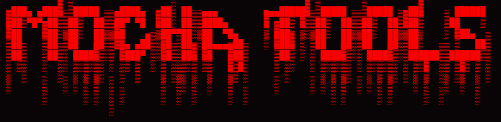

        

  

## HUGE THANKS TO [BINK-LAB](https://github.com/Bink-lab) FOR MOCHA, ACCESS TO IT AND THE API, AS WELL AS CONTRIBUTIONS
## Source Requirements
- Python 3.10 or higher (can be downloader [here](https://www.python.org/downloads/)
- PyQt6
- requests
- pyinstaller
- A Mocha account and an API key

### Running From Source
1. `git clone https://github.com/nxllxvxxd2/Mocha-Tools`
2. `cd Mocha-Tools`
3. `pip install -r requirements.txt`
4. `python mochatools.py`

## Features
- Uploads files to Mocha with a simple drag and drop interface, or selection through file manager.
- Folder upload support
- Upload speed and progress indicators
- Create share links with all options from within the program
- Ability to view files and folders
- Togglable debug mode for easier troubleshooting
- Share management, including viewing shares, toggling active or inactive, and deleting shares
- Remote ingest support

## Preview

 
  

 
  
  

  

## Potential? Ideas
| Idea | Complete? |
| :---- | :----: |
| Add download support for your own files | ✅ |
| Create android version | ❌ |
| Add to context menu (traditiional and Windows 11 (maybe idk how that works yet) for easy uploading | ❌ |
| Complete control over files, deletion, moving, sharing, etc. | ✅ |
| Debug and token management in its own tab | ✅ |
| Add support for multiple files and folders at once | ❌ |
| Configurable upload settings, such as chunk size and number of threads | ✅ |

|**CURRENT ISSUES**|
| :---- |
|<ul><li>~~Progress bar glitches after canceling upload~~</li><li>Under 50mb files are kinda buggy and drop resulting in EOF issues</li><li>100GB files not functioning (might be misreport will look into)</li><li>~~Selecting move folder doesn't select folder if inside~~</li><li>~~Upload speed and percent is buggy (especially on large files)~~</li><li>~~Unable to toggle share as active or inactive~~</li><li>~~Share link creation creates share but provides incorrect link~~</li><li>~~Folder upload just dumps all files in root without creating new folder~~</li><li>~~Original file names not being listed~~ Thank you [Bink-lab](https://github.com/Bink-lab)</li><li>~~Unable to move files~~</li><li>~~Unable to ~~create~~ or view shares~~</li><li>~~Large file upload is not working correctly~~ Thank you [Bink-lab](https://github.com/Bink-lab)</li><li>~~Uploading to specific existing folders is not functioning~~</li><li>~~Moving files or folders deeper than one folder does not function~~</li><li>~~Uploading deeper than one folder is not working~~</li></ul>|
